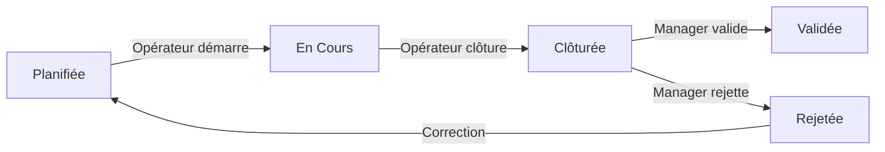

# 🚢 Gestion des Inspections – Application Web SIG

> Système complet de gestion des inspections des actifs portuaires pour Tanger Med Engineering

[](https://angular.io/)
[](https://nestjs.com/)
[](https://www.postgresql.org/)
[](https://postgis.net/)
[](https://openlayers.org/)

---

## 📌 Description

Application web full-stack pour la gestion digitalisée des inspections des infrastructures portuaires. Le système intègre :

- ✅ **Backend NestJS** – API RESTful sécurisée avec authentification JWT
- ✅ **Frontend Angular** – Interface utilisateur moderne et responsive
- ✅ **Base de données PostgreSQL/PostGIS** – Gestion des données relationnelles et géospatiales
- ✅ **Cartographie OpenLayers** – Visualisation SIG interactive
- ✅ **Workflow d'inspection** – Planification, exécution, validation
- ✅ **Calendrier FullCalendar** – Planification visuelle des inspections
- ✅ **Tableaux de bord analytiques** – Indicateurs de performance en temps réel

---

## 🏗️ Architecture du Projet

```
gestion-inspections/
├── backend/                    # API NestJS
│   ├── src/
│   │   ├── auth/              # Authentification JWT
│   │   ├── users/             # Gestion des utilisateurs
│   │   ├── actifs/            # Gestion des actifs
│   │   ├── inspections/       # Workflow d'inspection
│   │   ├── livrables/         # Upload de fichiers
│   │   └── database/          # Configuration TypeORM
│   ├── uploads/               # Fichiers téléversés
│   ├── .env                   # Variables d'environnement
│   ├── package.json
│   └── tsconfig.json
│
├── frontend/                   # Client Angular
│   ├── src/
│   │   ├── app/
│   │   │   ├── components/   # Composants UI
│   │   │   ├── services/     # Services API
│   │   │   ├── guards/       # Guards d'authentification
│   │   │   └── models/       # Interfaces TypeScript
│   │   ├── assets/           # Ressources statiques
│   │   └── environments/     # Configuration environnements
│   ├── package.json
│   └── angular.json
│
├── database/                   # Scripts SQL
│   ├── init.sql              # Initialisation de la BD
│   └── seed.sql              # Données de test
│
├── docs/                      # Documentation
│   └── ANDALOUSSI_RKIOUAK_KHOUSSI.pdf
│
├── README.md                  # Ce fichier
├── INSTALL.md                 # Guide d'installation détaillé
└── install.sh                 # Script d'installation automatique
```

---

## 🛠️ Stack Technologique

### Backend (NestJS)
| Package | Version | Usage |
|---------|---------|-------|
| `@nestjs/common` | ^10.0.0 | Framework core |
| `@nestjs/jwt` | ^10.0.0 | Authentification JWT |
| `@nestjs/passport` | ^10.0.0 | Stratégies d'auth |
| `@nestjs/typeorm` | ^10.0.0 | ORM base de données |
| `typeorm` | ^0.3.0 | Mapping objet-relationnel |
| `pg` | ^8.11.0 | Driver PostgreSQL |
| `bcrypt` | ^5.1.0 | Hachage de mots de passe |
| `multer` | ^1.4.5 | Upload de fichiers |
| `@nestjs/swagger` | ^7.0.0 | Documentation API |

### Frontend (Angular)
| Package | Version | Usage |
|---------|---------|-------|
| `@angular/core` | ^20.0.0 | Framework Angular |
| `@angular/forms` | ^20.0.0 | Gestion des formulaires |
| `@angular/router` | ^20.0.0 | Navigation |
| `ol` | ^9.0.0 | Cartographie OpenLayers |
| `ol-ext` | ^4.0.0 | Extensions OpenLayers |
| `@fullcalendar/angular` | ^6.1.0 | Calendrier |
| `@fullcalendar/core` | ^6.1.0 | Core FullCalendar |
| `@swimlane/ngx-charts` | ^20.5.0 | Visualisations de données |

### Base de données
- **PostgreSQL** 15+ – Base de données relationnelle
- **PostGIS** 3+ – Extension géospatiale

---

## 🚀 Installation Rapide

### Prérequis
- **Node.js** 20+ ([télécharger](https://nodejs.org/))
- **npm** 10+ (inclus avec Node.js)
- **PostgreSQL** 15+ ([télécharger](https://www.postgresql.org/download/))
- **Git** ([télécharger](https://git-scm.com/))

### Option 1 : Installation Automatique (Linux/Mac)

```bash
# Cloner le dépôt
git clone https://github.com/votre-repo/gestion-inspections.git
cd gestion-inspections

# Rendre le script exécutable
chmod +x install.sh

# Lancer l'installation
./install.sh
```

### Option 2 : Installation Manuelle

#### 1️⃣ Configuration de la Base de Données

```bash
# Se connecter à PostgreSQL
psql -U postgres

# Créer la base de données
CREATE DATABASE gestion_inspections;

# Activer PostGIS
\c gestion_inspections
CREATE EXTENSION postgis;
```

#### 2️⃣ Installation du Backend

```bash
cd backend

# Installer les dépendances
npm install

# Configurer les variables d'environnement
cp .env.example .env
# Éditer .env avec vos paramètres

# Lancer en mode développement
npm run start:dev
```

**Fichier `.env` requis :**
```env
# Base de données
DB_HOST=localhost
DB_PORT=5432
DB_USERNAME=postgres
DB_PASSWORD=geoinfo
DB_NAME=gestion_inspections

# Sécurité
JWT_SECRET=votre_cle_secrete_tres_longue_et_securisee_ici

# Environnement
NODE_ENV=development
PORT=3000
```

#### 3️⃣ Installation du Frontend

```bash
cd frontend

# Installer les dépendances
npm install

# Lancer l'application
ng serve
```

#### 4️⃣ Accéder à l'Application

- **Frontend** : http://localhost:4200
- **Backend API** : http://localhost:3000
- **Swagger Documentation** : http://localhost:3000/api

---

## 👥 Rôles et Fonctionnalités

### 🔑 Administrateur
- ✅ Gérer les utilisateurs et leurs rôles
- ✅ Créer et organiser les actifs (Famille → Groupe → Actif)
- ✅ Planifier les inspections
- ✅ Configurer les types d'inspection
- ✅ Consulter les tableaux de bord globaux

### 👷 Opérateur
- ✅ Consulter son planning d'inspections
- ✅ Démarrer une inspection
- ✅ Clôturer une inspection avec rapport
- ✅ Téléverser des documents
- ✅ Visualiser les actifs sur la carte

### 👔 Manager (Maître d'Ouvrage)
- ✅ Valider ou rejeter les inspections
- ✅ Consulter l'historique complet
- ✅ Analyser les indicateurs de performance
- ✅ Exporter des rapports

---

## 🗺️ Fonctionnalités SIG

### Cartographie Interactive (OpenLayers)
- 🗺️ Visualisation des actifs sur carte OpenStreetMap
- 🛰️ Mode satellite disponible
- 📍 Géolocalisation précise (EPSG:26191 → WGS84)
- 🎨 Symbologie dynamique selon l'état des actifs
- 🔍 Zoom, pan, navigation fluide
- 🔎 Filtrage spatial par zone/site
- 💬 Popups contextuelles avec détails

### Types de Géométries Supportés
- **Point** : Caméras, bornes, équipements ponctuels
- **Ligne** : Routes, quais, conduites
- **Polygone** : Entrepôts, zones, bâtiments

---

## 📅 Workflow d'Inspection



1. **Planification** – Administrateur crée l'inspection
2. **Exécution** – Opérateur démarre et réalise sur terrain
3. **Clôture** – Opérateur téléverse rapport et photos
4. **Validation** – Manager approuve ou rejette
5. **Traçabilité** – Historique complet des actions

---

## 📊 Captures d'Écran

### Tableau de Bord Administrateur


### Carte Interactive SIG


### Interface Opérateur


---

## 🔒 Sécurité

- 🔐 **Authentification JWT** – Tokens sécurisés avec expiration
- 🛡️ **Guards basés sur les rôles** – Contrôle d'accès granulaire
- 🔑 **Hachage bcrypt** – Mots de passe chiffrés
- 🚫 **Validation des entrées** – class-validator sur toutes les routes
- 📝 **Traçabilité complète** – Logs de toutes les actions

---

## 🧪 Tests

```bash
# Backend - Tests unitaires
cd backend
npm run test

# Backend - Tests e2e
npm run test:e2e

# Frontend - Tests unitaires
cd frontend
ng test

# Frontend - Tests e2e
ng e2e
```

---

## 📦 Build Production

### Backend
```bash
cd backend
npm run build
npm run start:prod
```

### Frontend
```bash
cd frontend
ng build --configuration production
# Les fichiers sont dans dist/frontend/
```

---

## 🐳 Déploiement Docker (optionnel)

```bash
# Construire les images
docker-compose build

# Lancer les services
docker-compose up -d

# Arrêter les services
docker-compose down
```

---

## 📚 Documentation API

La documentation complète de l'API est disponible via Swagger :
- **URL** : http://localhost:3000/api
- **Format** : OpenAPI 3.0
- **Endpoints** : Auth, Users, Actifs, Inspections, Livrables

---

## 🤝 Contribution

Ce projet a été réalisé par :
- **KHOUSSI Imane** – Développement backend & intégration SIG
- **ANDALOUSSI RKIOUAK Malak** – Développement frontend & UX/UI

**Encadrement** :
- M. Driss KHARBACH – Tanger Med Engineering
---


## 🔮 Perspectives Futures

- 📱 Application mobile terrain (mode hors ligne)
- 🤖 Maintenance prédictive par Machine Learning
- 🌐 Interopérabilité avec GMAO/ERP
- 🏗️ Jumeau numérique (Digital Twin) du port
- 📊 Tableaux de bord BI avancés
- 🛰️ Intégration données drones/satellites

---

**Développé avec ❤️ pour Tanger Med Engineering**

*Année universitaire 2024/2025 – FST Tanger*
